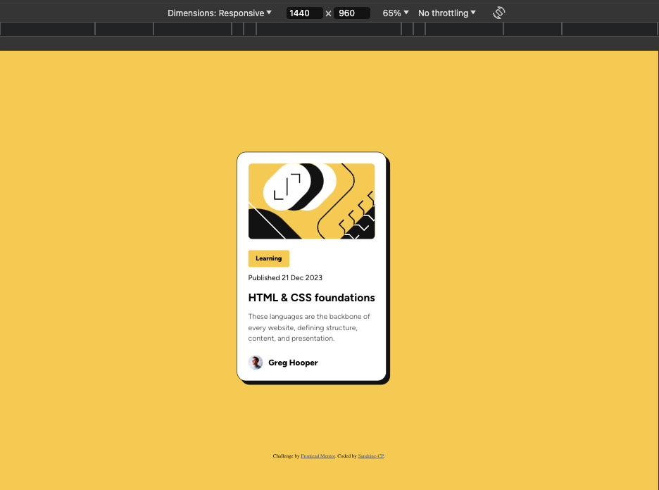
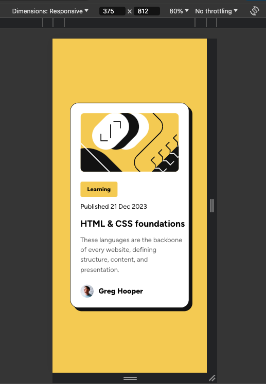

# Frontend Mentor - Blog preview card solution

This is a solution to the [Blog preview card challenge on Frontend Mentor](https://www.frontendmentor.io/challenges/blog-preview-card-ckPaj01IcS). 

## Table of contents

- [Overview](#overview)
  - [The challenge](#the-challenge)
  - [Screenshot](#screenshot)
  - [Links](#links)
- [My process](#my-process)
  - [Built with](#built-with)
  - [What I learned](#what-i-learned)
  - [Continued development](#continued-development)
- [Author](#author)

**Note: Delete this note and update the table of contents based on what sections you keep.**

## Overview

### The challenge

Users should be able to:

- See hover and focus states for all interactive elements on the page

### Screenshot

### Links

- Solution URL: (https://github.com/Sandrine-CP/blog-preview-card)
- Live Site URL: (https://sandrine-cp.github.io/blog-preview-card/)

## My process

1 Start with structuring html content with tags for better visibility
2 Adding html elements such as svg, tags img, h1, h2...attributes and classes.
3 Added stylesheet to manage css reset, styleguide extract from figma file in dev mode, and index css
4 index css file : work on mobile version first
5 Added media queries for desktop version
6 Added hover and focus elements
7 last adjustments comparing design target and my version

### Built with

- Semantic HTML5 markup
- CSS custom properties
- Flexbox
- Mobile-first workflow
- Figma pro version with dev mode

### What I learned

Figma dev mode helped me a lot to build the html structure and to work on the css.
I used some tips from a feedback on my previous challenge such as css reset file. 
I also created a separate css file for the styleguide with variable which soudend like a very god idea. Unfortunately, in my index.css I couldn't have the full list of variables, even with @ import the file : I couldn't solve this even after installing css intelissense extension and reboot VS Code, so I opened the styleguide file to copy-paste the needed variables : any tip on this would be much appreciated.
Maybe Figma helped me too much, I feel like I didn't code all by myself even if I had to do some adjustments.
I had hard time with the position of the card to make it centered in both versions mobile and desktop. I tried first with Figma's elements such as padding but didn't work well, not responsive at all. So I tried with percentages ans max width which seems better.
I also had some difficulties with the .title (HTLM&CSS foundations text) in mobile version to make it wrap and I discovered the white-spacing nowrap. It works, combined with font-size but I am not sure it is the best option.

### Continued development

Would like to continue focusing on responsive design with media queries.

## Author

- Website - [Add your name here](https://www.your-site.com)
- Frontend Mentor - [@yourusername](https://www.frontendmentor.io/profile/yourusername)

